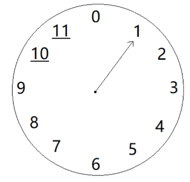
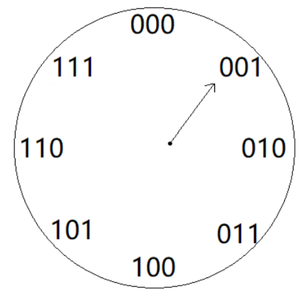

# 二进制原理（Bit Operation）

```
位运算 原码、反码、补码
```

###### 写在前面

本文会以教学问答的形式写出，这里先说明，这里的学生不是读者，而是我自己，我觉得学习带着问题学习是一个比较好的学习方法，而以这种教学问答的形式写作，能比较好的展示学习中的疑问。本文如有错误还请不吝赐教，万分感激。


###### 预备知识：

##### 什么是机器码位？

我们买东西的时候，商品上有条形码，这个条形码有13条，这个就是13码位，在比如15在二进制表示为 `1111` 是4个1，那就是4码位。我们一般说的电脑32位，64位，就是这个意思。可以简单理解为：**一个数据的长度就是它的机器码位。**


##### 机器数与真值

**机器数**: 顾名思义，就是在机器中表示一个数，例如2的4机器码位就是 0010 。

**真值**: 就是机器码对应的真正的数值，2在二进制中是10，那么 0010 机器数的真值就是：10 。

PS：将一个真值表示成二进制字串的机器数的过程就称为编码。


##### 原码，反码，补码

```js
原码: 是最简单的机器数表示法。用最高位表示符号位,1表示负号,0表示正号。其他位存放该数的二进制的绝对值。
```

```js
反码: 正数的反码还是等于原码,负数的反码就是他的原码除符号位外，按位取反。
```

```js
补码: 正数的补码等于它的原码,负数的补码就是它的 反码 + 1 。
```

PS：机器的运算都是以补码的方式进行的，下面是4位码的对照表。

| 真值 | 原码 | 反码 | 补码 |
| ---- | ---- | ---- | ---- |
| 7    | 0111 | 0111 | 0111 |
| 6    | 0110 | 0110 | 0110 |
| 5    | 0101 | 0101 | 0101 |
| 4    | 0100 | 0100 | 0100 |
| 3    | 0011 | 0011 | 0011 |
| 2    | 0010 | 0010 | 0010 |
| 1    | 0001 | 0001 | 0001 |
| 0    | 0000 | 0000 | 0000 |
| -1   | 1001 | 1110 | 1111 |
| -2   | 1010 | 1101 | 1110 |
| -3   | 1011 | 1100 | 1101 |
| -4   | 1100 | 1011 | 1100 |
| -5   | 1101 | 1010 | 1011 |
| -6   | 1110 | 1001 | 1010 |
| -7   | 1111 | 1000 | 1001 |

有了这张表是不是一下眼前一亮，原来是这么一回事呀，嗯，是的就是这么简单，但是还是有点懵逼，不知道为什么？想知其所以然，其实我觉得学到这里已经是可以了，不要往下学了，因为不知道原理也丝毫不影响你写代码的能力，知道也不会提升你一点写代码的能力，有时间多玩一会，他不爽吗？什么不行！不知道睡不着？好吧，那么我们开始讲一些没有用的。


##### 为什么用补码进行运算？

书接上文我们说了，机器的运算都是以补码的方式进行的，那为什么要用补码？还有为什么还要搞一个反码？不能直接就用原码计算吗？

行！你的问题有点多，慢慢解答，要搞清楚为什么有这么多码，就先了解一下什么是，计算机，一台经典计算机体系结构框架是由运算器，控制器，存储器，输入和输出设备组成。其中运算器，只有加法运算器。是的，计算机底层是很弱的。计算机也不认识2，计算机的世界里，只有 0 和 1，不仅仅如此，计算机也没有减法运算器。所有的减法是用加法模拟出来的。说一段题外话，计算机的底层就像单细胞生物，简单而且低弱，随着进化，现在这个星球已经没有比他们还厉害的东西了。

好，在说回正题，怎么用加法模拟减法？我们先做一道数学题，放心不难。

问题是：1+（?）= 0

答案是：1+（-1）=  0

嗯，很完美，也很简单，想让两个数相加和为0，只要加上他的相反数就可以了,现在我们用4位数机器码也就是原码，把上题重新做一遍。

答案是：0001 + 1001 = 1010

是的，错了，答案不是 0，而是 -2 。(你可以去上表上找一下，原码的1010，对应的真值)。这也就是回答你为什么不能用原码直接计算了。为什么会错了呢？错误原因很明显，【0001 +】 是不会错的，错的是1001，他并不是0001的相反数，答案能对就是奇了怪了。错误原因知道了，现在只要找到 0001 相反数就可以了。那开始找吧。


##### 相反数

相反数特性：若 a + b = 0，则a、b互为相反数。那就是说  0001 + (?) = 0000 ，这个可有点小麻烦，一个正整数相反数肯定是一个负整数，上面我们表上找一圈都没有找到符合我们要求的数，但是我们发现一个这样一个规律，那就是 ：

0001 + 1111 = 10000 ，

0010 + 1110 = 10000，

0011 + 1101 = 10000，

...

我们之前说过，这是4位机器码，但是结果是10000 是 5位数了，会怎么样呢，那么最高位会丢失。（可以这样理解，其实计算机会另外储存。）丢失之后就变成这样：

0001 + 1111 = 0000 ，

0010 + 1110 = 0000，

0011 + 1101 = 0000，

...

完美，终于找到了，0001 的相反数 可以设为 1111 但是这个 1111 怎么求得呢？

对其实很简单，就拿4位是机器码为例，其最大值就 1111，最大数在加1，就是 10000，它是五位数，也就是我们刚刚说的可以理解为 0000 ，即: 10000 - 0001 = 1111。好了，到这里我们终于找到 0001 的相反数了。它就是 (最大数 - 原码) + 1。到此我们可以推到出以下公式： 原码码 + (最大数 - 原码) + 1 = 0000。

好了，我们可以总结为：

(最大数 - 原码) 就是 原码的反码。即： (最大数 - 原码)  = 反码。

反码 + 1 就是 原码的补码 。即： (最大数 - 原码)  + 1 = 反码 + 1 = 补码。

接着我来回答你刚开始的问题，

问：什么要用补码？

答：因为要用加法模拟减法，所以就有了 减去一个数 等于 加上 这个数的相反数，相反数也就是它的补码。

问：那什么还有个反码？

答：补码 等于 反码 + 1 所以有了 反码。

问：.....

等一下，我不是回答完你的问题了吗？怎么你还要问？你的问题怎么那么多？你叫十万个为什么吗？

不问睡不着！

你可真是太多事睡不着了，好吧，那你就问一个吧。

问：为什么 (最大数 - 原码)  就等于 反码 ？还有为什么 反码 + 1 就 等于 补码 ？最大数怎么来的？接着还有10000

为什么可以代表 0000？10000 要是代表了 0000 那你让 0000 怎么想，0000 不要面子的吗。

答：你这是一个问题吗？你要是没个句号，我还以为你在背十万个为什么呢！


##### 模(同余)

要想回答你的问题，我们必须知道一个概念，那就是：模(同余)，那我们先看一下官方文档的解释：同余式是数论的基本概念之一，设m是给定的一个正整数，a、b是整数，若满足m|(a-b)，则称a与b对模m同余。你要是看懂了，我是佩服你的，你要没有看懂，那就是我故意的。我再来举一个10进制的例子：如果 (7-4) / 3 等于1，那么 7/3 的余 和 4/3的余 是相等的。即：7/3 的余 = 4/3的余。要想理解模(同余)的概念看一下我画的下面这张图。



从上图可以看出，画的真丑。好了，那不是重点。重点是：这是一个时钟图，尽管被我改造的和你见的时钟不大一样，但是也不影响它是一个时钟。这个时钟图就可以看成一个12进制的模，现在是1点，我想到2点的位置，只要顺时针走一点就可以，还有别的方式吗？当然还可以逆时针走11点。所以11点和1点对模。

好了通过以上我们的例子，不难理解，原码码与补码对模关系，如下图：



 是的，正如你发现的000与100是对模关系，但是不要慌，问题不大。还记得我们上面说的吗？在原码的定义中用最高位表示符号位。以上图举个例子，3位机器码中，最大正整数是3，即 011。所以永远不会用到100这个来做补码，只需要不理会就可以了。在想想一个问题，3位机器码是几个数呢？对8个，那他的最大值是 111，对应的真值7（十进制）,所以就是：真值 + 1 才是它的对模数。好了，我们来回答一下刚刚那些问题。

问：为什么 (最大数 - 原码)  就等于 反码 ？

答：反码其实就是原码补数，100为和，30的补数就是70。最大数为和，即：反码 = 最大数 - 原码。

问：最大数怎么来的？

答：最大数就是机器码的最大真值数，3位机器码中，最大真值数，是111就是7（十进制）。

问：还有为什么 反码 + 1 就 等于 补码 ？

答：刚说过了最大数为和，反码其实就是原码补数，可是最大数的真值数并不是对模数，真值数+1才是对模数。以3位码举例子：因为3位机器码是从000开始到111结束，有8个数，而111的机器码的真值数是7，所以 最大数 + 1 就等于对模数。

问：10000为什么可以代表 0000？10000 要是代表了 0000 那你让 0000 怎么想，0000 不要面子的吗？

答：0000 要不要面子我不知道，但是用同余式表示：1111 + 1 就是0000 ，因为 10000 与 0000同余。
