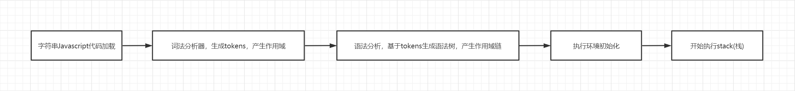

# JavaScript 解析器

`定义:`  **JavaScript(JS) or ECMAScript 是一种具有函数优先，解释型编程语言，它由事件与对象驱动，支持面向过程，面向对象，命令式和声明式编程。**


#### 内存模型

js引擎(JavaScriptCore)，在解析语法后，其内存模型分为5个区：

* 栈区：存放函数的参数值、局部变量等。
* 堆区：引用类型，包含 function ，new 操作，不包含字面量声明。
* 静态区：全局变量和静态变量。
* 常量区：常量存储在这里。


#### 解析器工作流



javaScript 并不需要编译，代码的执行可以分成这几个步骤：

1. 字符串Javascript代码加载
2. 词法分析器，生成tokens，产生作用域
3. 语法分析，基于tokens生成语法树，产生作用域链
4. 执行环境初始化
5. 开始执行stack(栈)


下面的代码程序是如何运行的？

```javascript
var f;function f(){var a};function a(){}
```

首先引擎会先将上面的代码生成下面的语法树 (ps:简化版伪代码)

```javascript
{
    scope_chain: [ [global_scope_chain] ],
    program: [
        {
            type: 'VariableDeclaration',
            id: { type: 'Identifier', name: 'f' },
            tokens: { 
                start: 0, 
                end: 5,
                scope_chain: [ [VariableDeclarator.f: undefined] ]
            }
        },
        {
            type: 'FunctionDeclaration',
            id: { type: 'Identifier', name: 'f' },
            tokens: {  
                start: 7, 
                end: 25,
                scope_chain: [ [reference_global_scope_chain], a: undefined ]
            }
        },
        {
            type: 'FunctionDeclaration',
            id: { type: 'Identifier', name: 'a' },
            tokens: {  
                start: 27, 
                end: 45,
                scope_chain: [ [reference_global_scope_chain] ]
            }
        }
	]
}
```

一个变量只在一定范围内可以使用，这个范围我们称之: **作用域**。

javaScript采用了词法作用域，函数体内的变量的作用域是在函数定义时候确定的。也就是说函数体内的局部变量是在词法解析的时候确定的。我们把保存函数体内局部变量的对象叫: **变量对象 VO（Variable Object）**。

局部变量以外还有一个全局对象，在最外层，我们把这个对象叫做: **全局对象 GO (Global Object)**。 

当函数被调用时，都会创建一个新的对象来保存当前函数的局部变量的值，把这个新的对象叫做：**活动对象 AO（Activation Object）**。

在语法解析的时候，嵌套的函数的AO有个一个引用关系，类似一个链表结构，表头就是GO，当函数被调用时AO会加入在表尾。函数执行后若没有被第三方引用AO，那么AO将被GC回收。这种引用链关系我们叫它： **作用域链**。

每一个函数体内都包含着自己的作用域链表，这种函数包含自身作用域链表的行为，我们称之为：**闭包**。（ps:从这个角度看所有的函数都有闭包，函数返回函数只是闭包的使用方法而已）。

**代码实解：**

```javascript
// 1)
console.log(f) // undefined
var f
```

1)	打印在前，声明在后，程序并没有抛出异常，原因都知道是：**变量提升**；那这个提升的原理就是：javaScript引擎在词法解析的时候已经确定了作用域。所以在运行打印的时候并不会抛错。

```javascript
// 2)
console.log(f) // [Function: f]

function f () {}
var f = undefined
```

2)	打印出来是一个方法（[Function: f]），而不是undefined，原因都知道是**变量声明**的优先级大于**函数声明**；那这个优先级大的原理就是：javaScript引擎在词法解析的时候并不会将方法f当变量解析，而是当做函数声明，接下来当代码执行时，会创建AO，并将方法f挂载在AO下，所以打印出来是一个方法（[Function: f]）

```javascript
// 3)
var f = undefined
function f () {}

console.log(f) // undefined
```

3)	打印出来是undefined，原因都知道是**声明操作**的优先级大于**赋值操作**；那这个原因其实就是：var f 就是在VO 对象下声明了一个f等于undefined，接下来当代码执行时，会创建AO，并将方法f挂载在AO下，此时f是function，然后又对AO对象的f进行了赋值成undefined，所以最后的结果就是undefined。


#### 内存的管理

​	标记清除：

　　这是javascript中最常用的垃圾回收方式。当变量进入执行环境是，就标记这个变量为“进入环境”。从逻辑上讲，永远不能释放进入环境的变量所占用的内存，因为只要执行流进入相应的环境，就可能会用到他们。当变量离开环境时，则将其标记为“离开环境”。

　　垃圾收集器在运行的时候会给存储在内存中的所有变量都加上标记。然后，它会去掉环境中的变量以及被环境中的变量引用的标记。而在此之后再被加上标记的变量将被视为准备删除的变量，原因是环境中的变量已经无法访问到这些变量了。最后。垃圾收集器完成内存清除工作，销毁那些带标记的值，并回收他们所占用的内存空间。
