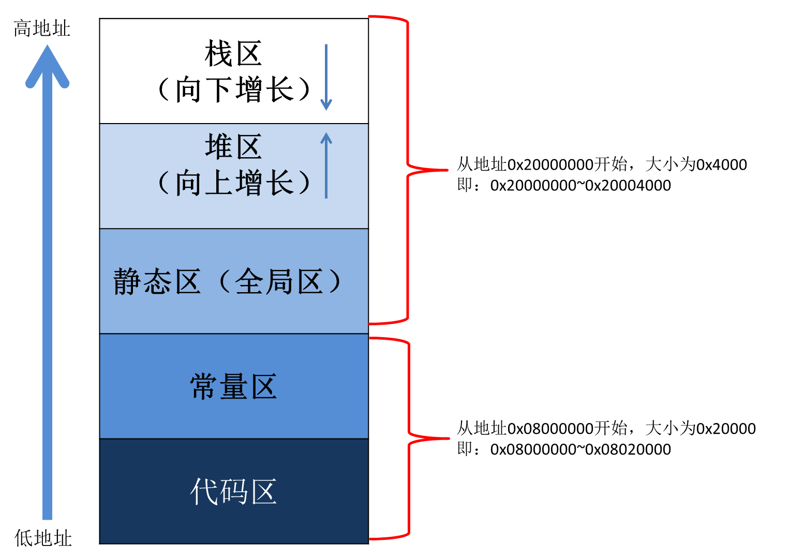

# JavaScript 解析器

`定义:`  **JavaScript(JS) or ECMAScript 是一种具有函数优先，解释型编程语言，它由事件与对象驱动，支持面向过程，面向对象，命令式和声明式编程。**


#### JavaScript是怎么样执行的？

从字符串到CPU执行的机器指令集，代码要经过多层转换，可以简要理解成下面3层；

1. 编译层：将代码转换成可执行结构，更高效的提供给引擎使用。
2. 代理层：代码运行在引擎提供的代理之上。这个代理可以理解成一个虚拟机（Virtual Machine），它管理者着JavaScript一切，包括：环境变量，内存管理，任务调度，错误处理等。
3. 执行层：执行代码指令，操作内存，协作系统进程或线程；


#### JavaScript是怎么编译的（编译层）？

​	浏览器被发明的早期，对JavaScript的工作要求很简单，比如验证表单等。它的执行速度也确实不快。采用的编译模式一般都是静态编译（AOT）；随着JavaScript的代码结构和语法复杂度提高，同时需要动态生成代码以支持动态类型和其他特性。浏览器厂商纷纷加入了及时编译（JIT）。现在的浏览器为了性能，也是无所不用其极，采用了混合编译。


#### 编译步骤

1. 词法分析（Lexer）：将JavaScript源代码分解为单个的词元（Token），每个词元代表一个词法单元，例如标识符、关键字、运算符和分隔符等。词法分析器负责将JavaScript代码中的字符序列转化为Token（记号）序列。

   ```js
   // 源代码
   var f；
   
   // 解析成（Token）标记
   Token(type: keyword, value: "var", start: 0, end: 3)
   Token(type: identifier, value: "f", start: 4, end: 5)
   Token(type: punctuation, value: ";",start: 5, end: 6)
   ```

   

2. 语法分析（Parser）：将序列转化为Token序列，转换成抽象语法树（AST）。

   * 语法解析器（Syntax Parser）：将词法分析器生成的Token序列转化为抽象语法树（AST Transformer），并进行语法检查，确保代码符合JavaScript语言规范。我们常见的`Invalid or unexpected token` 就是这个阶段报出来的。

   

   * 在转化为抽象语法树（Abstract Syntax Tree）时候会确定**作用域**以及**作用域链**；也就是说JavaScript采用了语法分析产生**作用域**。这也是为什么变量提升的原因，经管在声明之前访问变量，也可以在作用域链上找到变量。

     ```js
     // 源代码
     var f;function f(){var a};function a(){}
     
     // 解析成抽象语法树（Abstract Syntax Tree）
     {
         scope_chain: [ [global_scope_chain] ],
         program: [
             {
                 type: 'VariableDeclaration',
                 id: { type: 'Identifier', name: 'f' },
                 tokens: { 
                     start: 0, 
                     end: 5,
                     scope_chain: [ [VariableDeclarator.f: undefined] ]
                 }
             },
             {
                 type: 'FunctionDeclaration',
                 id: { type: 'Identifier', name: 'f' },
                 tokens: {  
                     start: 7, 
                     end: 25,
                     scope_chain: [ [reference_global_scope_chain], a: undefined ]
                 }
             },
             {
                 type: 'FunctionDeclaration',
                 id: { type: 'Identifier', name: 'a' },
                 tokens: {  
                     start: 27, 
                     end: 45,
                     scope_chain: [ [reference_global_scope_chain] ]
                 }
             }
     	]
     }
     ```

   

3. AST优化器（AST Optimizer）：用于优化抽象语法树，以支持JavaScript代码的性能提升和优化。抽象语法树转换器负责对AST进行修改和转换，以实现一些特定的功能，例如代码压缩、代码优化、语法转换等。

   

4. JIT编译器（Just-In-Time Compiler）：JIT编译器是一种动态编译器，为了提高代码的执行速度。

   * 它会将代码分成多个块（代码块），并进行编译和优化。

   * 它可以将执行的代码动态地编译成**字节码**(Intermediate Language : 一种中间代码)。

   * 它在函数第一次被调用时，会将函数编译成**字节码**，并将**字节码**缓存起来，以便下次调用时直接使用。

   * 在**AST**转换成**字节码**过程中还用用到代码优化器和反优化器：

     * **代码优化器（Code Optimizer）**：通过使用它达到多种优化技术，如常量折叠、链路猜测、复写优化、剪枝优化，缓存优化等，以提高代码的执行效率和减少内存占用。
     * **代码反优化器（Code Deoptimizer）**：当执行到破坏型代码（如：eval）时，将通过它来恢复到未优化的状态，或者清除优化重新补偿等。

       * **eval(永远不要使用 )**

         ​	 `eval` 函数调用 JS 解释器执行代码，通常更慢。比如更改该变量的类型，因此会强制浏览器重新执行所有已经生成的**字节码**以进行补偿。它使用与调用者相同的权限执行代码，更容易别攻击。

         ​	javascript的执行上下文，是javascript引擎在语法分析时确定的。对于`eval` 要执行的代码，解析器只能将`eval` 的执行上下文指向当前函数的执行上下文。这意味指eval不能被引用调用，比如下面的代码，eval的执行上下文就会被指向全局执行上下文。

         ```js
         var context = 'Global context';
         function fn() {
             var context = 'fn context';
             var vm = eval;
             vm('console.log(context)'); //  'Global context'
         	eval('console.log(context)'); //  'fn context'
         	(0, eval)('console.log(context)'); //  'Global context'
         }
         
         fn()
         ```
         
         
     
   * 除此之外它还加入了，**热点代码检测器（Hotspot Detector）**，用于识别被频繁执行的代码段，当一个函数被识别成热点帧时，会调用**AOT编译器**将热点函数编译成**机器码**以提高执行速度。**机器码**存放在**代码区**并且是只读的。
   
     
   
5. JIT编译器编译的字节码并不能直接执行，JIT编译器通常分为两个阶段：编译和执行。在执行阶段会用**字节码解释器（Bytecode Interpreter）** 将字节码转换为机器码，以便在不同的计算机上执行JavaScript代码。


#### JavaScript是怎么运行的（代理层）？

​	在执行 JavaScript 代码的时候，JavaScript 运行时实际上维护了一组用于执行 JavaScript 代码的**代理**。每个代理都是由[事件循环](./EventLoop.md)驱动的。

* 执行上下文栈
* 执行上下文的集合
* 任务队列
* 微任务队列


**作用域链**

​	每个函数都有自己的环境变量，这些变量的**作用域**就是这个函数；函数执行时需要，它自己的变量，自己父辈函数的变量，以及全局变量；这些变量所属的链路叫**作用域链**。


**变量对象（Variable Object）**

​	JavaScript 采用了词法作用域，当函数被编译运行时，会根据**作用域**创建一个VO，存储当前作用域中的变量、函数声明和函数的形参。VO对象会更具作用域链查找到其他的VO对象。它被引用到执行上下文中。


**全局对象 (Global Object)**：

​	全局变量对象，是指全局变量环境，包含了所有的全局变量和函数。GO是作用域链表中最后一项，是VO查找的最后一个表尾对象。


**闭合操作（Closed Operation）**

​	函数可以访问到VO对象，而VO对象又可以查找整个作用域链上的VO对象。所有我们可以把函数看做一个闭合开关，通过它来操作这个作用域链上的VO对象。这一做法叫做**闭包**。


**执行上下文**

​	函数在执行是依赖于环境信息，**每一个函数都有自己的执行上下文**。它记录着函数要运行的所有环境信息包括：

* 全局对象 (Global Object)：也称为全局变量对象，是执行上下文的全局变量环境，包含了所有的全局变量和函数。
  
* 变量对象（Variable Object）：在执行上下文创建时，会创建一个变量对象，它包含了当前执行上下文中定义的所有变量、函数和形参等信息。
  
* 作用域链（Scope Chain）：作用域链是一个指向父级作用域的指针列表，它用于解析当前执行上下文中引用的变量和函数。作用域链由当前执行上下文的变量对象和所有外层执行上下文的变量对象组成。
  
* this 关键字：this 关键字用于引用当前函数执行时的上下文对象，它的值取决于函数的调用方式。
  
* 代码执行位置（Code Evaluation State）：表示 JavaScript 引擎在执行哪一行代码，以便能够正确处理异常信息和调试代码。
  
* 执行状态标志（Execution State Flag）：用于标识当前代码执行的状态，比如是否处于函数调用、try-catch 块、循环语句等。


#### 执行上下文栈

​	当一个函数在内核（CPU）中执行时，需要依赖内存中的环境数据。这些数据抽象在执行上下文中。函数与函数的执行顺序抽象在**执行上下文栈**数据结构里；通常也被称为“执行栈”（Execution Stack）。

​	执行上下文栈是JavaScript 运行时代理，遵循后进先出（Last-In-First-Out）的原则，用于记录函数调用的层次和执行上下文的变化。

​	当一个函数执行时，调用了另一个函数，则这两个函数依次进入“执行栈”。当栈顶函数执行完毕后则弹出，依次执行下面的函数。直到执行栈清空。在去完成下一个““执行栈””。


#### 执行上下文的集合

​	在 JavaScript 中代码运行之前就创建了全局执行上下文，每当执行一个新的代码块时，就会创建一个新的执行上下文，因此，执行上下文的集合是一个动态的集合，随着代码的执行而不断变化。包括了当前执行的所有的执行上下文，以及在执行这些代码块时创建的所有子执行上下文。

* **执行上下文类型**

  下面 3 种类型的代码会创建一个新的执行上下文：

  * 全局上下文是为运行代码主体而创建的执行上下文，也就是说它是为那些存在于 JavaScript 函数之外的任何代码而创建的。

  * 每个函数会在执行的时候创建自己的执行上下文。

  * 使用 `eval()` 函数也会创建一个新的执行上下文。

::: warning

​	 eval 函数在Firefox浏览器中，有第二个参数，指定上下文执行对象。这个参数是非标准的，并且明确地从 Firefox 4 中删除。也就是eval函数会创建一个新的执行上下文，在当前所在函数直接调用的情况下，eval的执行上下文和调用它的所在函数的执行上下文保持一致，否则eval将和全局执行上下文保持一致。

:::

```js
var context = 0
function first(){
    console.log(context); // undefined
    var context = 1
    function later(){
        console.log(context); // undefined
        var context = 2;
        eval(`
          console.log(context); // 2
          var context = 3;
        `)
         console.log(context); // 3
	}
    later()
    console.log(context); // 1
}
	
first();
```


#### 任务队列

​	JavaScript 是单线程语言，为了协调系统事务。采用了一种任务消息处理机制。当运行时调用其他进程或线程来处理任务，当任务完成时，系统会将完成消息发给JavaScript 线程。接受管理这一消息的队列叫**任务队列**。系统完成的任务消息保存在队列中，按照先进先出（FIFO）的原则循环执行。这种处理机制叫[事件循环](./EventLoop.md)。


#### 微任务队列


​	JavaScript 代码运行，可以当做多个任务组成的。每个任务中使用微任务来控制代码的执行顺序,	实现异步处理；

​	任务与微任务区别在于：

* 处理任务对象不同：它们虽然都是异步的，但是任务是由系统完成然后交给JavaScript 处理回调的。而微任务是JavaScript 用来控制代码执行顺序的由JavaScript 完成。
* 触发阶段不同：JavaScript 使用微任务来控制代码的执行顺序；所以微任务属于当前任务的一部分，因此JavaScript 先处理完微任务，才能处理下个任务；
* 大小不同：任务是由系统完成，触发回调。每个任务都有可能包含一个异步微任务队列；所以通常也被称为**宏任务**。


#### 代码是怎么执行的（执行层）？

​	JavaScript 是单线程语言， 通过消息队列管理事务的执行顺序，通过执行栈管理着任务的执行顺序；所有的信息都放在堆上；

* 每一个任务可以看做一个执行栈，一个执行栈完成完再处理下个任务，所以任务与任务是阻塞的。
* JavaScript 准许将一些执行帧，安排到栈顶执行，所以执行帧可以是异步的；


`java script`代码执行时，可以看成3大模块

* 堆模块，这里可以理解成数据储存块，声明的变量和对象都在这里，又称堆储存空间。

* 栈模块，所有方法都要在这里执行，又称执行栈。
* 队列模块，所有的消息，异步事件都在这里，又称消息队列。


**栈 Stack**

函数调用可能形成了一个由若干帧组成的栈。一帧可以理解成一个函数。


**堆 Heap**

对象被分配在堆中，堆是一个用来表示一大块（通常是非结构化的）内存区域的计算机术语。


**消息队列 Queue**

一个 JavaScript 运行时包含了一个待处理消息的消息队列。每一个消息都关联着一个用以处理这个消息的回调函数。


#### 运行时内存结构



内存模型(基于STM32内核)

* 栈区：存放函数的参数值、局部变量等。
* 堆区：引用类型，包含 function ，new 操作，不包含字面量声明。
* 静态区：全局变量和静态变量。
* 常量区：常量存储在这里。
* 代码区：存放程序的代码，即CPU执行的机器指令，并且是只读的。


#### 内存的管理

垃圾回收是一种自动管理程序内存的机制，可以自动识别不再使用的对象并将其回收，从而避免内存泄漏和崩溃等问题。引用计数器和标记清除器都是垃圾回收算法的一种。

* 引用计数器（Reference Counter）：
  * 引用计数器算法是最基本的垃圾回收算法之一。其原理是每个对象维护一个引用计数器，当该对象被引用时，引用计数器加1，当该对象不再被引用时，引用计数器减1。当一个对象的引用计数器变为0时，说明该对象已经无法被使用，可以被回收。
  * 缺点：但是，引用计数器算法有一个致命缺陷，即无法处理循环引用的情况。比如，对象A引用了对象B，而对象B也引用了对象A，此时它们的引用计数器值都不为0，就无法被垃圾回收器回收，从而导致内存泄漏。

* 标记清除器（Mark and Sweep）：
  * 标记清除器算法是一种能够处理循环引用的垃圾回收算法。它的工作原理分为两个阶段：标记阶段和清除阶段。在标记阶段，垃圾回收器遍历程序中的所有对象，标记所有仍然被使用的对象。在清除阶段，垃圾回收器清除所有未被标记的对象。这样，就可以避免循环引用导致的内存泄漏问题。
  * 缺点：尽管标记清除器可以处理循环引用的问题，但是它也存在一些缺点。例如，标记清除器在清除未被标记的对象时，会产生内存碎片问题，这会影响内存的利用效率。此外，标记清除器需要停止程序的运行，才能进行垃圾回收，这会对程序的响应速度产生影响。


#### 面试题解析
