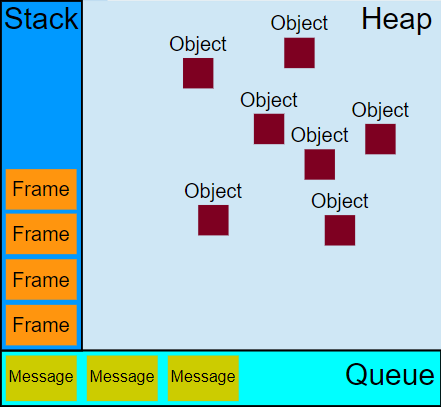
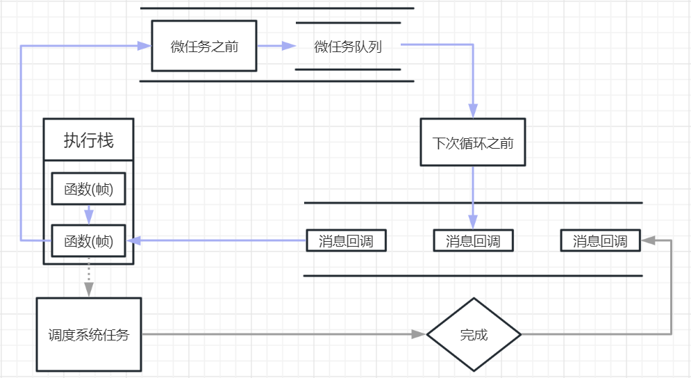
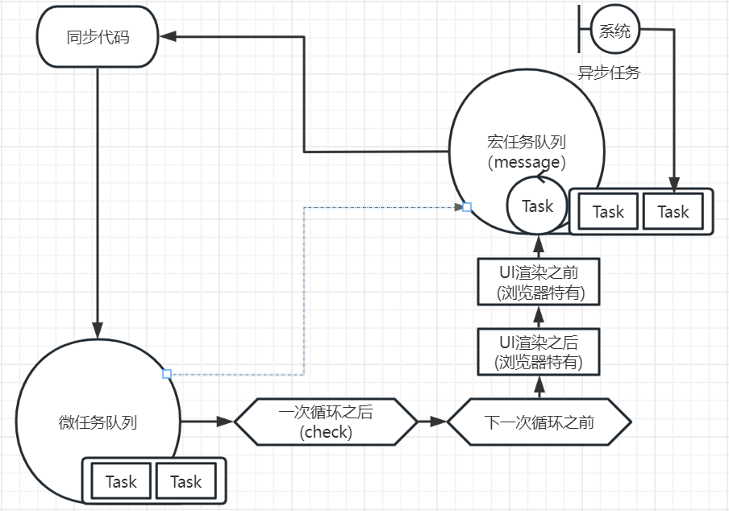

# 事件循环（Event Loop）

#### 什么是 Event Loop？

为了协调事件，用户交互，脚本，渲染，联网等，必须使用事件循环。一个 JavaScript 运行时包含了一个待处理消息的消息集合。每个消息代理都有一个关联的事件循环，该循环对于该代理是唯一的。一个事件循环具有一个或多个任务队列。一个任务队列是一组任务。


#### 运行时执行结构



**栈 Stack**

函数调用可能形成了一个由若干帧组成的栈。一帧可以理解成一个函数。


**堆 Heap**

对象被分配在堆中，堆是一个用来表示一大块（通常是非结构化的）内存区域的计算机术语。


**队列 Queue**

只允许在一端插入数据操作，在另一端进行删除数据操作的特殊线性表；进行插入操作的一端称为队尾（入队列），进行删除操作的一端称为队头（出队列）；队列具有先进先出（FIFO）的特性。


`java script`代码执行时，可以看成3大模块

* 堆模块，这里可以理解成数据储存块，声明的变量和对象都在这里，又称堆储存空间。

* 栈模块，所有方法都要在这里执行，又称执行栈。
* 队列模块，所有的消息，异步事件都在这里，又称消息队列。

`ps`: 这里所讲的队列或消息队列，和线性表数据结构的队形完全不是一回事，没有先进先出（FIFO）的特性，这里的队形更像数据结构中的集合。消息队列中的消息一旦被消费就会出队列。下面提到的**任务队列**或**微任务队列**才是真正的FIFO队列。


#### 事件循环流程图




在事件循环中消息队列是一个很重要的概念，为了消除网络请求系统IO等的耗时，javaScript执行时会将这些事件挂起当并绑定消息回调，等待系统触发回调时再加入执行栈。当执行栈再遇到异步事件又会将事件挂起以此反复。


#### 事件循环代码执行流程图



一个事件循环具有一个或多个任务队列。一个任务队列是一组任务。

例如，一次事件循环可以对计时器，网络请求等任务队列进行检查，将可执行的任务加入任务队列。这里有一个微任务的概念，就是说不需要检查直接要触发的事件比如`process.nextTick`,` Promises.then`, `MutationObserver`，也就是说要在检查可执行任务前加入任务队列，再加入可执行任务，推入执行栈。


**代码实解：**

```javascript
Promise.resolve().then(f=>{
    console.log(1)
    setTimeout(f=>{
        console.log(4)
    })    
})

setTimeout(f=>{
    console.log(2)
    Promise.resolve().then(f=>{
        console.log(3)
    })
})

// browser: 1 2 3 4
// ps: 低版本的node中，运行结果并不确定也有可能是: 1 2 4 3
```

代码执行步骤：

1. `Promise.then` 和 `setTimeout`都是异步任务
2. `Promise.then` 是微任务直接被加入任务队列
3. `setTimeout` 等待系统超时调用然后加入任务队列
4. `Promise.then` 和 `setTimeout` 推入执行栈
5. `Promise.then` 执行，输出1，并将内层`setTimeout` 加入消息集合，等待系统超时调用
6. `setTimeout` 执行，输出2，并直接将内层`Promise.then`加入任务队列
7. 内层`Promise.then` 和 内层`setTimeout` 推入执行栈
8. 内层`Promise.then` 执行，输出3
9. 内层`setTimeout`执行，输出4 

结果是1 2 3 4 。

`ps`: 上面的代码在低版本的node中，运行结果并不确定也有可能是: 1 2 4 3 , 接下来开始讲讲node中的事件循环是咋回事。


#### `Node.js`中的Event Loop

首先想了解一下`Node.js`的构成；


一个`Node.js`的应用由`V8`引擎提供给`javaScript`运行时，然后`V8`通过`Node.js`的`api`调用`Node.js`的虚拟机（`libuv`）,	由`libuv`提供给`V8`的系统操作能力。

在 `Node.js` 中，`V8`只是`javaScript`运行时。`libuv` 提供了一个线程池处理诸如文件 I/O 等高成本的任务。所以node并不是单线程的。 在 `Node.js` 中，有两种类型的线程：一个事件循环线程（也被称为主循环，主线程，事件线程等）。另外一个是在工作线程池里的 `k` 个工作线程（也被称为线程池）。

`Node.js` 使用事件驱动机制：它有一个事件轮询线程负责任务编排，和一个专门处理繁重任务的工作线程池。

例如 `Node.js` 程序运行时，程序首先完成初始化部分，即处理 `require` 加载的模块和注册事件回调。 然后，`Node.js` 应用程序进入事件循环阶段，通过执行对应回调函数来对客户端请求做出回应。 此回调将同步执行，并且可能在完成之后继续注册新的异步请求。 这些异步请求的回调也会在事件轮询线程中被处理。

事件轮询线程本身并不维护队列，而是去监听操作系统变化，把它转换成合适的事件，然后触发与该事件对应的回调函数。

相对而言，工作线程池则使用一个真实的(FIFO)队列，里边装的都是要被处理的任务。 一个工作线程从这个队列中取出一个任务，开始处理它。当完成之后这个工作线程向事件循环线程中发出一个“任务完成了”的消息。

保证永远不要阻塞事件轮询线程。 换句话说，每个 JavaScript 回调应该快速完成。 这些当然对于 `await`，`Promise.then` 也同样适用。

下面的图表展示了事件循环操作顺序的简化概览。


#### `Node.js`工作队列阶段概述

- **定时器**：本阶段执行已经被 `setTimeout()` 和 `setInterval()` 的调度回调函数。
- **待定回调**：执行延迟到下一个循环迭代的 I/O 回调。
- **idle, prepare**：仅系统内部使用。
- **轮询**：检索新的 I/O 事件;执行与 I/O 相关的回调（几乎所有情况下，除了关闭的回调函数，那些由计时器和 `setImmediate()` 调度的之外），其余情况 node 将在适当的时候在此阻塞。
- **检测**：`setImmediate()` 回调函数在这里执行。
- **关闭的回调函数**：一些关闭的回调函数，如：`socket.on('close', ...)`。

```javascript
// demo 1
setTimeout(() => {
  console.log('1');
});

setImmediate(() => {
  console.log('2');
});

// 1 2 or  2 1

// demo 2
const fs = require('fs');

fs.readFile(__filename, () => {
  setTimeout(() => {
    console.log('1');
  });
  setImmediate(() => {
    console.log('2');
  });
});

// 2 1
```

demo 1的结果是不确定的，demo 2的结果则永远不变的。demo 1结果的原因就是：`setTimeout` ，`setImmediate` 在从主模块内被调用，事件轮询线程将最先调用可执行的方法。换句话说：事件轮询线程没有队列机制谁快调用谁。`setTimeout` 方法受到系统环境影响，有可能在`setImmediate`方法后别调用。这也解释了为什么在老版本的`Node.js`为什么结果可能是 1 2 4 3的原因。

demo 2 为什么结果就是确定的呢，原因是: `fs.readFile`这个是工作线程中调用，当完成之后通知事件轮询线程，然后事件轮询线程将轮询下一个步骤，check阶段，`setImmediate`此时被调用，然后接着下一步骤 close callbacks 阶段，最后轮询结束，进入新的轮询，timers   阶段，此时定时器被调用。这就是为什么结果一定是 2 1原因。

总结：

1. 所有同步任务都在主线程上执行，形成一个执行栈（execution context stack）。
2. 主线程之外，还用一个工作线程，维护一个"任务队列"（task queue）。只要异步任务有了运行结果，就在"任务队列"之中放置一个事件。
3. 一旦"执行栈"中的所有同步任务执行完毕，系统就会读取"任务队列"，看看里面有哪些事件。那些对应的异步任务，于是结束等待状态，进入执行栈，开始执行。
4. 主线程不断重复上面的第三步。


#### 工作线程 `process.nextTick`

工作线程维护了一个(FIFO)队列，在上图中事件循环操步骤中并没有`process.nextTick`步骤，但其实它是工作线程的队列操作方法，而且两个`API`类似，但它们的名称令人费解。实质上，这两个名称应该交换，因为 `process.nextTick` 比 `setImmediate` 触发得更快，`process.nextTick` 在每次轮询前触发，`setImmediate` 在事件循环的接下来的迭代或 'tick' 上触发。也就是说，`process.nextTick`指定的任务总是发生在所有异步任务之前。`setImmediate()` 是当前轮询阶段完成后就触发。议开发人员在所有情况下都使用 `setImmediate`，因为它更容易理解。

**`process.nextTick()` 对比 `setImmediate()`**

* `process.nextTick` 比 `setImmediate` 触发得更快。

- `process.nextTick()` 在同一个阶段立即执行。
- `setImmediate()` 在事件循环的接下来的迭代或 `tick` 上触发。
- `process.nextTick` 可以阻止事件循环到达轮询阶段(递归)。

#### 两个事件循环机制的区别

* 浏览器中的事件循环有一个微任务队列，这使得一些异步方法每一次都会在前面调用。
* `Node.js`有两个（两个类型）线程，工作线程负责异步队列调用。


