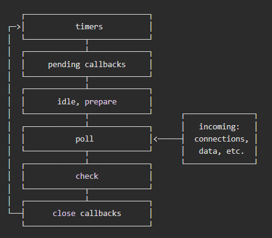

# 事件循环（Event Loop）

#### 什么要 Event Loop？

​    主要用于解决异步编程的问题，协调异步事务如：用户交互，脚本执行，渲染，联网，I/O等。它是一种执行代码的方式，是 JavaScript 引擎中的一部分。


#### Event Loop 工作模式


​	在 JavaScript 中，所有代码都是单线程的，事件循环也可以看成是一种消息机制。 就是JavaScript 引擎包含了一个待处理消息的消息队列。当异步任务完成时，系统将推入一个待处理消息进入队列。在事件循环期间的某个时刻，运行时会从最先进入队列的消息开始处理队列中的消息。被处理的消息会被移出队列，并作为输入参数来调用与之关联的回调函数。


::: tip

之所以称之为 **事件循环**，是因为它经常按照类似如下的方式来被实现：

```js
while (queue.waitForMessage()) {
  queue.processNextMessage();
}
```

:::


#### 事件循环步骤

​	由**事件循环**驱动着每个步骤。事件循环负责收集用事件（包括用户事件）、对任务进行排队以便在合适的时候执行回调。然后它执行所有处于等待中的 JavaScript 任务（宏任务），然后是微任务，然后在开始下一次循环之前执行一些必要的渲染和绘制操作。

1. 同步代码执行完，清空当前执行栈；
2. 执行微任务之前；
3. 执行微任务队列的任务，并清空当前所有微任务；
4. 下一次循环之前的一些必要执行；
5. UI渲染之前 (浏览器特有：**requestAnimationFrame**)；
6. UI渲染之后  (浏览器特有：**requestIdleCallback** )；
7. 处理最先进入消息队列的消息（宏任务），处理宏任务会反复上面的步骤，直到清空消息队列。然后等待异步任务（异步任务完成的消息），再继续重复执行；


#### 什么是微任务 Micro Task？

​	例如`Promise.then`中切换**执行上下文**这种任务就是微任务。**事件循环**会依次执行由系统推进消息任务(宏任务)。但是有些场景，比如`Promise.then`还是需要将某些函数帧(微任务)，延迟到当前**执行上下文栈**清空后再执行。所以这就要依赖**事件循环**编排这些微任务(函数帧)，不能依赖系统消息机制。这些微任务(函数帧)是一个 FIFO 队列叫它**微任务队列**。


#### 宏任务 vs 微任务

宏任务队列和微任务队列的区别很简单，但却很重要：

- 当执行来自任务队列中的任务时，在每一次新的事件循环开始迭代的时候运行时都会执行队列中的每个任务。在每次迭代开始之后加入到队列中的任务需要**在下一次迭代开始之后才会被执行**.
- 每次当一个任务退出且执行上下文为空的时候，微任务队列中的每一个微任务会依次被执行。不同的是它会等到微任务队列为空才会停止执行——即使中途有微任务加入。换句话说，微任务可以添加新的微任务到队列中，并在下一个任务开始执行之前且当前事件循环结束之前执行完所有的微任务。


#### `Node.js`中的Event Loop


::: tip 

​	Node.js在10版本之前，事件循化处理微任务模式，和浏览器不同。

:::

#### 什么是Node.js？

​	它服务器端 JavaScript 运行时环境 。建立在 Google Chrome V8 JavaScript 引擎之上。 提供了一种事件驱动的编程模型，使用非阻塞 I/O 操作，可以使开发者在服务器端使用 JavaScript。


#### `Node.js`的构成

​	首先想了解一下`Node.js`的构成；

* 由`V8`引擎提供给`javaScript`运行时；
* 通过 Node.js C++ bindings；给JavaScript调用操作系统的能力；
* 由libuv实现一个跨平台的异步I/O库，它是Node.js事件循环的核心组件；


#### Node.js 线程

* 事件循环线程（也被称为主循环，主线程，事件线程等）。
* 工作线程池里的 `k` 个工作线程（也被称为线程池）。

​	`Node.js`并不是单线程的。有两种类型的线程：`主线程`,`工作线程`， 这两种类型的线程是阻塞模式。 如果任意一个回调或任务需要很长时间，则运行线程将被阻塞。

​	`主线程`通过Event Loop来驱动编排任务，工作线程负责完成异步任务。当工作线程任务完成时，会向主线程发出一个“任务完成”的消息。这个消息由`事件循环线程`来消费。

​	下面的图表展示了事件循环操作顺序的简化概览。每个框被称为事件循环机制的一个阶段，每个阶段都有一个 FIFO 队列来执行回调。队列处理完毕，进入下一阶段。




#### `Node.js`工作队列阶段概述

- **定时器**：本阶段执行已经被 `setTimeout()` 和 `setInterval()` 的调度回调函数。
- **待定回调**：执行延迟到下一个循环迭代的 I/O 回调。例如，如果 TCP 套接字在尝试连接时接收到 `ECONNREFUSED`，则某些 *nix 的系统希望等待报告错误。
- **idle, prepare**：仅系统内部使用。
- **轮询**：检索新的 I/O 事件;执行与 I/O 相关的回调（几乎所有情况下，除了关闭的回调函数，那些由计时器和 `setImmediate()` 调度的之外），其余情况 node 将在适当的时候在此阻塞。
- **检测**：`setImmediate()` 回调函数在这里执行。
- **关闭的回调函数**：一些关闭的回调函数，如：`socket.on('close', ...)`。


#### 事件循环机制


* `setTimeout()`  

  ​	计时器是指：在指定`阈值`时间后触发回调的任务。工作线程(系统)在到达时间后，将回调任务添加到**事件循环队列**的`timers`阶段，等待**事件循环**进入该阶段来执行。但是指定触发的时间，不是执行时间。等到**事件循环**处理到该回调的时候，此时才是确切的触发时间。中间可能遇到有其他的调度或其它正在运行的回调。这都会延迟长触发时间。

* `nextTick()`

  ​	您可能已经注意到 `process.nextTick()` 在图示中是一个微任务，它在同步代码执行完，立即执行，尽管它叫nextTick；

  * `process.nextTick()`其实它不是事件循环的一部分。它要优于其他微任务先执行。
  * 当前执行栈清空后就会立即执行 `process.nextTick()`，允许它递归调用，所以它能**阻止事件循环**到达轮询阶段；

* `setImmediate()` 

  * `setImmediate()` 执行晚于`nextTick()`，这个往往让人感到诧异。这是应为Node.js早期实现造成的。如果能将这两个名称交换那就很完美，单是... 。（no way）

  * `setImmediate` 本质`libuv`在实现它时，也是当一种特殊计时器。它被指定在一次**事件循环**时间后触发。

  * `setTimeout `和`setImmediate` 都在初始化运行，运行顺序可能是不确定的。原因是代码执行步骤是这样的：

    1. 初始化环境，包括**事件循环队列**等；
    2. 主栈同步代码执行，执行中可能会调用异步任务，此时**工作线程**开启工作，完成后将回调添加到**事件循环队列**中。
    3. 然后开始处理事件循环。
    
    当setTimeout指定0，为立即触发时。**工作线程**将回调添加到**事件循环队列**中。这不是瞬时发生的，这依赖系统处理。所以会出现两种情况：

    * 主栈代码执行快于添加回调，则是setImmediate先执行。因为此时timers队列是空的；
    * 主栈代码执行慢于添加回调，则是setTimeout先执行。因为**事件循环**优先处理timers阶段；
    
    * ```js
      setTimeout(() => {
        console.log('1');
      });
      
      setImmediate(() => {
        console.log('2');
      });
      
      // 1 2 or  2 1 运行顺序不确定
      
      /*******************************/
      
      setTimeout(()=>{
        console.log(1)
      })
      
      const complexTimer = Date.now()
      while (Date.now() - complexTimer < 20) {
        // do nothing
      }
      
      setImmediate(()=>{
        console.log(2)
      })
      
      // 1 2
      ```


#### 面试题解析
