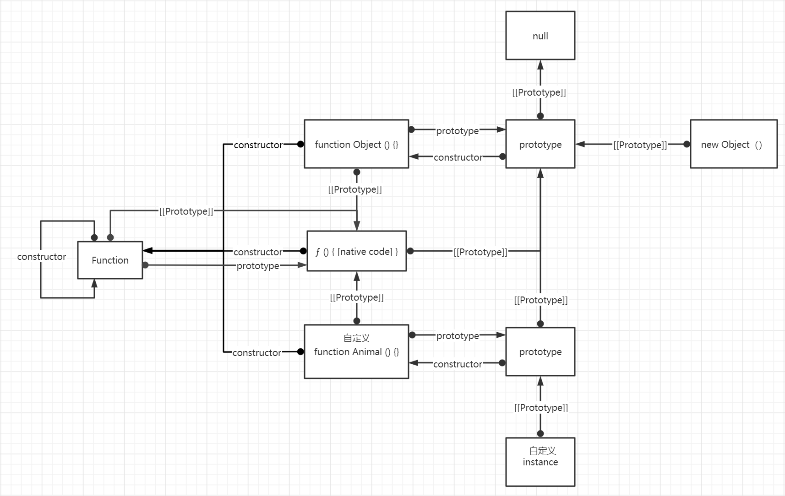

# 面向对象（oop）

#### 编程范型

* 指令式
  * 几乎所有计算机的硬件都是设计来运行机器码，使用命令式的风格来写的。
* 面向过程
  * 就是分析出解决问题所需要的步骤，然后用函数把这些步骤一步一步实现，使用的时候一个一个依次调用就可以了。（C语言）
* 面向对象
  * 为了建立逻辑抽象模型，体现出来的思维过程。解决复杂的逻辑复用。（面向对象编程特征有：“抽象”，“封装”，“继承”。一般面向对象语言特点有“多态”，“封装”，“继承”。OOP=类+对象+继承+多态+消息，其中核心概念是类和对象）
* 函数化
  * 思想来源于范畴论，一切事物皆是范畴，通过函数将一个范畴态射成另一个范畴。函数化编程思路就是将逻辑视为范畴；逻辑与结果的关系通过函数转换；（函数式编程3大特点：函数是一等公民，没有副作用，组合； FOP=高阶函数+纯函数+柯里化）


#### `javaScript` 中对象

​	在`javaScript` 中对象的定义是: 无序的属性集合（像散列表），每一个对象，都有一个原型指针[[Prototype]]，指向自己的原型, 原型链是`javaScript` 中实现面向对象编程的最重要的概念。


#### 原生继承图




#### 原型链

原型链，类似于链表结构，`__proto__`是指向下一个表的指针。这里的`__proto__`就是上面说的原型指针[[Prototype]]，非标准的实现。`ES2015`给了两组标椎`API`，

* `Object.getPrototypeOf`

* `Reflect.getPrototypeOf`

* `Object.setPrototypeOf`

* `Reflect.setPrototypeOf`

**警告: **` JIST`优化尝试在调用实例之前猜测方法在内存中的位置,使用上面的任何方法，动态设置原型干扰了所有的优化，非常影响性能，强烈不建议使用。

下面的代码，就是利用原型指针`__proto__`共享数据：

```javascript
// demo1
var superType = {
    superType: 'superType'
}

var subType = {
    subType: 'subType'
}

subType.__proto__ = superType

console.log(subType.superType) // superType
```


#### 原型指针和原型链指针

原型指针`prototype` 和 原型链指针`__proto__`,可以理解成`prototype` 是`function`命名空间，当方法被`new` 调用时，`prototype` 空间会被实例化成原型对象，`__proto__`就是原型链指针，指向该对象的原型。也就是说`prototype` 是函数上的属性而`__proto__`则是实例上的属性，两个指针指向同一个对象。

以下伪代码将解释new的运行原理，值得一说是`function`也是对象。

```javascript
// 这里我们先将 function 函数理解成一个对象,如果有new，这个对象理解成new创建的this空间对象
var functionObject = {
    name: 'function'
}

// 可以理解成prototype是function命名空间，如果有new，也就是this空间对象的命名空间
functionObject.prototype = {
    constructor: functionObject
}

// 这里我们先将 new 关键字解成一个方法
function newFunction (funObj){
    // 模拟拿到函数的返回参数，假设挂载在result上
    var result = funObj.result
    
    // 函数的返回值如果是引用类型则new不做操作
    if( result !== null && (typeof result === 'function' || typeof result === 'object') ){
        renturn result
    }
    
    // 1)获取原型对象
    var prototyp = funObj.prototype
    // 2)创建实例对象
    var instance = Object(funObj)
    // 3)设置实例原型
    instance.__proto__ = prototyp
    
    //4) 返回实例
  	renturn instance
}

```


#### 原型链继承

```javascript
function prototypeCreate(prototype) {
	function TempConstructor(){};
    TempConstructor.prototype = prototype;
    return new TempConstructor();
}

var superType = {
    superType: 'superType'
}

var subType = prototypeCreate(superType)
subType.subType = 'subType'

console.log(subType.superType) // superType

```

这里和`demo1`的代码效果其实是一致的。性能要更佳优越，其实代码实现了将一个对象设置成一个新对象的原型，`ES2015`为了规范这种操作给了一个标准`API`: `Object.create` 


#### 类式继承

在大多数`OOP`语言中，有两种继承方式，接口继承和实现继承。动态语言的`javaScript`只能用实现继承。

类是实例的抽象层，实例是类的具象。类式继承一般可以这样规划。

* 类字段

* 类方法

* 实例字段

* 实例方法

**构造函数**

原则上说函数不区分构造函数和不是构造函数一说（箭头函数除外），因为函数本质都是一样的，只不过用来模拟类式继承的函数，我们给了一个特别的叫法，**构造函数**，一般构造函数还有一个约定就是首字母大写。

`javaScript`字段与方法没有严格区分，开篇介绍过类似于散列表是属性的集合，`javaScript`类式继承一般可以这样规划。

* 构造函数的属性

* 原型对象的属性

* 实例的属性

  把原型对象模拟成类，也就是说原型是类的标识符；

```javascript
// 定义一个动物类
function Animal (name) {
  // 实例属性
  this.className = name || throw new Error('Animal need a className');
  // 实例方法 
  // ps: 你不会用到它的（ya ain't gonna need it）
  // 这里sleep不应在这里，如果每一个动物类都有sleep方法，那么他就应该是类的方法，
  // 如果只是实例上有，那么他就是应该在实例上定义，不应该出现在这里。
  this.sleep = function () {
    console.log(this.name + '正在睡觉！');
  }
}

// 类的静态属性
Animal.Biology = true
// 类的静态方法
Animal.stretch = function () {}

// 如果你重写了原型
// 例如: Animal.prototype = {}
// 那么他就会丢失构造函数指针(constructor)
// 你需要重新定义它，这是一个好习惯，就像这样  Animal.prototype.constructor = Animal
// 动物类的移动方法，将继承到每一个实例中
Animal.prototype.move =  function () {}
```

**继承父类**

```javascript
function Cat () {
    // 增强实例
    Animal.call(this, '猫')
}

// 继承类

// 1) 这里动态改了原型指针，会影响性能，但是方案确实好用
Cat.prototype.__proto__ = Animal.prototype

// 2) 这个方法比较繁琐，兼容性强，但是性能确实要好
function TempConstructor(){};
TempConstructor.prototype = Animal.prototype;
Cat.prototype = new TempConstructor(){};
Cat.prototype.constructor = Cat;

// 3) ES2015的Object.create
Cat.prototype = Object.create(Animal.prototype,{constructor: value: Cat})

```


#### class 继承

与函数一样，类也可以使用表达式和声明式定义，值得注意的是类的声明式定义不会像函数一样拥有声明提升，其实class的继承仍然是基于原型链的，class只是意在简化语法，规范操作。

##### **class定义一个类**

```javascript
const Animal = class AnimalClass {
  getClassName() {
    return AnimalClass.name;
  }
};

console.log(AnimalClass) // SyntaxError: Identifier 'Animal' has already been declared
```

上面代码使用表达式定义了一个类。需要注意的是，这个类的名字是`AnimalClass`，但是`AnimalClass`只在 Class 的内部可用，指代当前类。在 Class 外部，这个类只能用`Animal`引用。


##### **static 关键字的静态方法**

```javascript
class Animal {
   // 类的静态方法，函数同样适用    
	static stretch () {
    }
};
```


##### **私有属性 # 修饰符**

```javascript
class Animal {
   // # 是一个私有属性，函数同样适用
   #PrivateName = 'privately-owned';
};
```


##### **计算属性**

```javascript
class Animal {
	// 和对象一样类上的属性和方法，同样也支持计算属性
	activenName = 'activen'
    [activenName] () {}
};
```


##### **类上的方法定义**

```javascript
class Animal {
	// 如果某个方法之前加上星号（*），就表示该方法是一个 Generator 函数。
    * [Symbol.iterator]() {
        for (let arg of this.args) {
          yield arg;
        }
      }

 	// 属性也可以设置 getter 和 setter 方法。同样私有方法属性也可以
    get currentName() { return this.className; }
    set currentName (value) {
		this.className = value;
	}
    
    // 静态属性方法也可以添加访问器，getter 和 setter 方法。
    static get stretch () {
        return this.className;
    }
    static set stretch (value) {
        this.className = value;
    }
    
  }
}

```


##### **constructor 构造函数**

```javascript
class Animal {
	constructor (name){
        this.name = name;
    }
}

```


Class 内部调用是严格模式，`new.target`在`constructor`里执行当前实例的父类，如果不在构造函数里则是`undefined`。

```javascript
class Animal {
	constructor (name){
      console.log(new.target === Animal) // true
    }
    static stretch () {
    }
    getClassName() {}
}

```


##### **extends**继承

父类的静态方法也会继承，这点很重要，也就是说子类完全继承父类。在之前 构造函数式继承并没有实现这一点。

```javascript
class Cat extends Animal {
    speak() {
      console.log(this);
    }
}

console.log(Cat.stretch)
```


##### **`super` 关键字**

用于调用对象的父对象上的函数。**`super`**是调用父类构造函数的方法，而且子类的上`constructor` 的并没有初始化`this`，它需要父类构造出来，所以在子类中使用`this`，需要先调用父类的构造函数。

```javascript
class Cat extends Animal {
    constructor (name){
        // 调用构造函数
     	super('猫')
        console.log(this)
    }
}
```

super本质是构造继承对象，它拥有类原型的方法和静态属性。但是访问不到实例的属性。

```javascript
class Cat extends Animal {
  // 使用父类的静态方法 
  static stretch (...arg) {
      return super.stretch(...arg)
  }
  // 调用原型上的方法
  getClassName (...arg) {
      return super.getClassName(...arg)
  }
}
```


 ##### **在对象字面量中使用`super.prop `**不能覆写不可写属性.

```javascript
var obj1 = {
  method() {
    console.log("method in obj1");
  }
}

var obj2 = {
  method() {
   super.method();
  }
}

Object.setPrototypeOf(obj2, obj1); // 性能不好，不要这样做
obj2.method(); // method in obj1
```


##### Species

你可能希望在派生数组类 *`MyArray`* 中返回 `Array`对象。这种 species 方式允许你覆盖默认的构造函数。

例如，当使用像`map()`返回默认构造函数的方法时，您希望这些方法返回一个父`Array`对象，而不是`MyArray`对象。`Symbol.species` 符号可以让你这样做：

```javascript
class MyArray extends Array {
  // 将species覆盖到父数组构造函数
  // Symbol.species 是个函数值属性，其被构造函数用以创建派生对象。
  static get [Symbol.species]() { return Array; }
}
var a = new MyArray(1,2,3);
var mapped = a.map(x => x * x);

console.log(mapped instanceof MyArray); 
// false
console.log(mapped instanceof Array);   
// true
```


##### `Mix-ins`

抽象子类或者 mix-ins 是类的模板。 一个 `ECMAScript `类只能有一个单超类，所以想要从工具类来多重继承的行为是不可能的。子类继承的只能是父类提供的功能性。因此，例如，从工具类的多重继承是不可能的。该功能必须由超类提供。一个以超类作为输入的函数和一个继承该超类的子类作为输出可以用于在`ECMAScript`中实现混合：

```javascript
var calculatorMixin = Base => class extends Base {
  calc() { }
};

var randomizerMixin = Base => class extends Base {
  randomize() { }
};
```

使用 mix-ins 的类可以像下面这样写：

```javascript
class Foo { }
class Bar extends calculatorMixin(randomizerMixin(Foo)) { }
```

